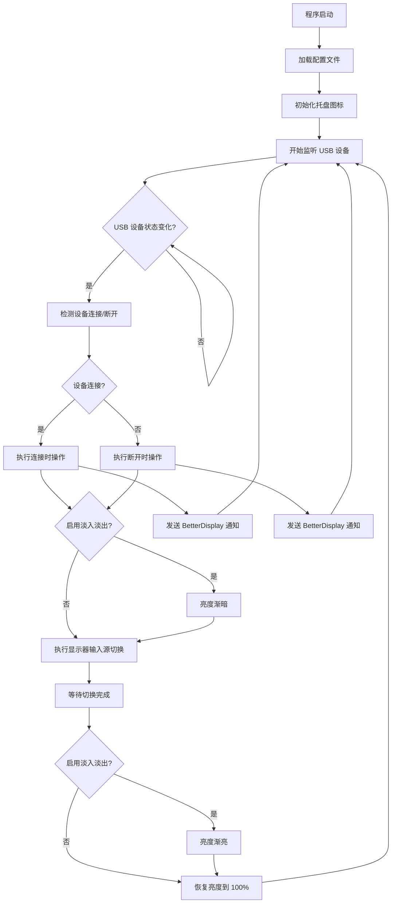
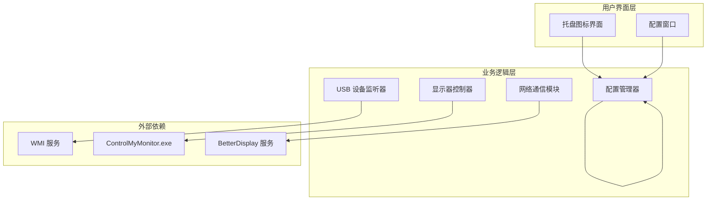

# AutoDisplaySwitch - 自动显示器切换工具

[](https://opensource.org/licenses/MIT)
[](https://dotnet.microsoft.com/)
[](https://github.com/yourusername/auto_display_switch/stargazers)
[](https://github.com/yourusername/auto_display_switch/issues)

## 🤖 AI生成声明

本项目由AI生成，可自由修改。

## 📖 项目简介

本项目是针对最近火爆的mac mini不用KVM切换器的软件解决方案。

AutoDisplaySwitch 是一个 Windows 应用程序，用于根据 USB 设备的连接/断开状态自动切换显示器输入源。该工具特别适用于在 Windows 和 macOS 双系统之间切换的场景，通过检测指定的 USB 设备（如键盘、鼠标等）来触发显示器输入源的切换。

### ✨ 核心特性

- 🔌 **自动检测 USB 设备**：实时监听指定 USB 设备的连接和断开事件
- 🖥️ **智能切换显示器输入源**：支持 ControlMyMonitor 和 BetterDisplay 两种控制方式
- 🌅 **亮度淡入淡出效果**：在切换过程中提供平滑的亮度过渡效果
- 📱 **托盘图标显示**：根据设备连接状态显示不同的托盘图标
- 🖱️ **手动切换选项**：右键托盘图标可手动切换显示器输入源
- 💾 **配置文件保存**：所有设置自动保存到 JSON 配置文件

## 📋 目录

- [系统要求](#-系统要求)
- [安装步骤](#-安装步骤)
- [配置说明](#-配置说明)
- [使用方法](#-使用方法)
- [构建说明](#-构建说明)
- [技术实现](#-技术实现)
- [流程图](#-流程图)
- [常见问题](#-常见问题)
- [版本历史](#-版本历史)
- [贡献指南](#-贡献指南)
- [许可证](#-许可证)
- [联系方式](#-联系方式)

## 系统要求

- Windows 10/11
- .NET 9.0 或更高版本
- ControlMyMonitor.exe（用于控制显示器）
- BetterDisplay（可选，用于 macOS 端的显示器控制）

## 安装步骤

1. 下载项目文件到本地目录
2. 确保 ControlMyMonitor.exe 在同一目录下
3. 运行 AutoDisplaySwitch.exe

## 配置说明

### 基本配置

1. 启动应用程序后，程序会最小化到托盘
2. 右键托盘图标，选择"修改配置"打开设置窗口

### USB 设备选择

1. 在设备列表中选择要监控的 USB 设备
2. 点击"保存"按钮保存配置

### BetterDisplay 设置（可选）

如果需要在 macOS 端配合控制显示器：

1. 填写 BetterDisplay 的 IP 地址
2. 填写端口号（默认为 55777）
3. 填写 Token（用于安全验证）

### 切换选项

- **设备断开时执行 ControlMyMonitor**：USB 设备断开时切换到 Mac 输入源
- **设备断开时发送 BetterDisplay**：USB 设备断开时通知 macOS 端
- **设备连接时执行 ControlMyMonitor**：USB 设备连接时切换到 Windows 输入源
- **设备连接时发送 BetterDisplay**：USB 设备连接时通知 macOS 端
- **启用淡入淡出效果**：在切换过程中使用亮度淡入淡出效果，提供更平滑的切换体验

## 🛠️ 构建说明

### 环境要求

- .NET 9.0 SDK 或更高版本
- Visual Studio 2022 或其他支持 .NET 9.0 的 IDE

### 构建步骤

1. 克隆项目到本地：
   ```bash
   git clone https://github.com/yourusername/auto_display_switch.git
   cd auto_display_switch
   ```

2. 恢复 NuGet 包：
   ```bash
   dotnet restore AutoDisplaySwitch/AutoDisplaySwitch.csproj
   ```

3. 构建项目：
   ```bash
   dotnet build AutoDisplaySwitch/AutoDisplaySwitch.csproj --configuration Release
   ```

4. 发布项目：
   ```bash
   dotnet publish AutoDisplaySwitch/AutoDisplaySwitch.csproj --configuration Release --runtime win-x64 --self-contained false
   ```

### 依赖项

- **System.Management**：用于 WMI 查询 USB 设备
- **Newtonsoft.Json**：用于 JSON 配置文件处理
- **System.Net.Http**：用于与 BetterDisplay 的 HTTP 通信

## 使用方法

### 自动切换

1. 配置好 USB 设备和显示器设置后，程序会自动监控设备状态
2. 当指定的 USB 设备连接时，自动切换到 Windows 输入源
3. 当指定的 USB 设备断开时，自动切换到 Mac 输入源

### 手动切换

右键托盘图标：
- **切换至 MAC**：手动切换到 Mac 输入源
- **切换至 WIN**：手动切换到 Windows 输入源
- **修改配置**：打开设置窗口
- **退出**：退出程序

## 配置文件

程序会自动在同一目录下创建 `config.json` 文件，包含所有配置信息：

```json
{
  "SelectedDeviceId": "USB\\VID_05AC&PID_024F\\...",
  "BDIP": "192.168.1.100",
  "BDPort": "55777",
  "BDToken": "373137461",
  "DisconnectExecute": true,
  "DisconnectSendBD": true,
  "ConnectExecute": true,
  "ConnectSendBD": true,
  "EnableFadeEffect": true
}
```

## 技术实现

### 核心组件

- **USB 设备监听**：使用 WMI 查询 Win32_USBHub 类监听设备事件
- **显示器控制**：通过调用 ControlMyMonitor.exe 控制显示器输入源
- **网络通信**：使用 HTTP 请求与 BetterDisplay 通信
- **异步处理**：所有切换操作都是异步执行，确保界面响应性

## 🔄 流程图

### USB 设备检测和显示器切换流程



### 程序架构图



### 错误处理

- USB 设备检测失败时记录日志但不中断程序
- 显示器控制命令执行失败时记录日志
- 网络通信失败时记录日志但继续执行其他操作

## 常见问题

### Q: 程序启动后看不到窗口？

A: 程序默认最小化到托盘，右键托盘图标选择"修改配置"打开设置窗口。

### Q: USB 设备检测不到？

A: 确保设备正确连接，尝试刷新设备列表或重启程序。

### Q: 切换不生效？

A: 检查 ControlMyMonitor.exe 是否在正确位置，确保显示器支持 DDC 控制。

### Q: BetterDisplay 连接失败？

A: 检查 IP 地址、端口和 Token 是否正确，确认 BetterDisplay 正在运行并启用了网络控制。

## 📈 版本历史

### v1.0.0 (2024-01-XX)
- ✨ 初始版本发布
- 🔌 支持 USB 设备自动检测
- 🖥️ 支持 ControlMyMonitor 和 BetterDisplay 集成
- 🌅 支持亮度淡入淡出效果
- 📱 托盘图标界面
- 💾 JSON 配置文件支持

## 🤝 贡献指南

我们欢迎任何形式的贡献！请遵循以下步骤来参与项目开发：

### 开发环境设置

1. Fork 本项目
2. 克隆你的 fork：
   ```bash
   git clone https://github.com/yourusername/auto_display_switch.git
   ```
3. 创建功能分支：
   ```bash
   git checkout -b feature/your-feature-name
   ```
4. 安装依赖并构建项目（参考[构建说明](#-构建说明)）

### 代码规范

- **命名规范**：使用 PascalCase 命名类和方法，camelCase 命名变量
- **注释**：为复杂逻辑添加中文注释
- **异常处理**：妥善处理异常，避免程序崩溃
- **异步编程**：使用 async/await 模式处理异步操作

### 提交规范

提交信息请遵循以下格式：
```
<type>(<scope>): <subject>

<body>

<footer>
```

**Type 类型：**
- `feat`: 新功能
- `fix`: 修复bug
- `docs`: 文档更新
- `style`: 代码格式调整
- `refactor`: 代码重构
- `test`: 测试相关
- `chore`: 构建过程或工具配置更新

**示例：**
```
feat(usb-detection): 添加多设备同时监听支持

- 支持同时监听多个 USB 设备
- 优化设备检测算法，提高准确性

Closes #123
```

### 提交 Pull Request

1. 确保代码通过所有测试
2. 更新文档（如需要）
3. 提交 PR 时提供详细描述，包括：
   - 解决的问题
   - 实现方案
   - 测试方法

### 报告问题

使用 [GitHub Issues](https://github.com/yourusername/auto_display_switch/issues) 报告问题时，请提供：
- 详细的问题描述
- 复现步骤
- 系统环境信息
- 相关日志或截图

## 📄 许可证

本项目采用 MIT 许可证开源。

```
MIT License

Copyright (c) 2024 AutoDisplaySwitch

Permission is hereby granted, free of charge, to any person obtaining a copy
of this software and associated documentation files (the "Software"), to deal
in the Software without restriction, including without limitation the rights
to use, copy, modify, merge, publish, distribute, sublicense, and/or sell
copies of the Software, and to permit persons to whom the Software is
furnished to do so, subject to the following conditions:

The above copyright notice and this permission notice shall be included in all
copies or substantial portions of the Software.

THE SOFTWARE IS PROVIDED "AS IS", WITHOUT WARRANTY OF ANY KIND, EXPRESS OR
IMPLIED, INCLUDING BUT NOT LIMITED TO THE WARRANTIES OF MERCHANTABILITY,
FITNESS FOR A PARTICULAR PURPOSE AND NONINFRINGEMENT. IN NO EVENT SHALL THE
AUTHORS OR COPYRIGHT HOLDERS BE LIABLE FOR ANY CLAIM, DAMAGES OR OTHER
LIABILITY, WHETHER IN AN ACTION OF CONTRACT, TORT OR OTHERWISE, ARISING FROM,
OUT OF OR IN CONNECTION WITH THE SOFTWARE OR THE USE OR OTHER DEALINGS IN THE
SOFTWARE.
```

## 📞 联系方式

- **项目主页**: [https://github.com/yourusername/auto_display_switch](https://github.com/yourusername/auto_display_switch)
- **问题反馈**: [GitHub Issues](https://github.com/yourusername/auto_display_switch/issues)
---

<div align="center">

**如果这个项目对你有帮助，请给我们一个 ⭐ Star！**

Made with ❤️ by the AutoDisplaySwitch team

</div>
